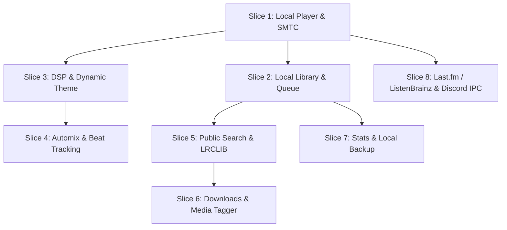
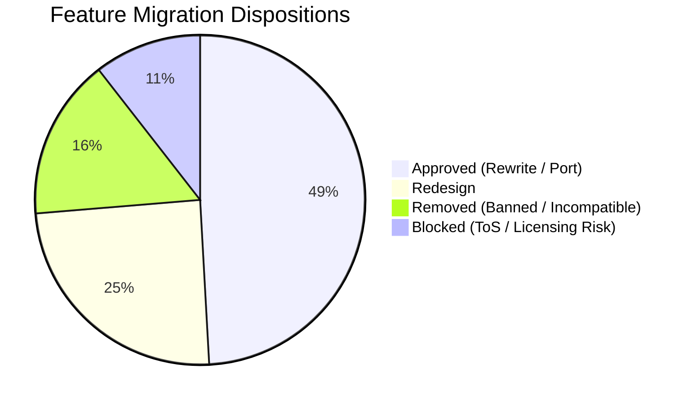

# BitChord — Android → WinUI 3 Migration Inventory & Technical Specification

> **Source of Truth:** Android application codebase located at `app/src/main/java/com/music/bitchord/` (and native DSP/ML analysis code at `native/analyzer/`).
> Every item, file reference, class, function, and line range below has been verified against the active Android source repository.
> **Scope & Governance:** This document defines the formal migration inventory, architectural disposition, technical evidence, compliance boundaries, complete desktop UI specification, and phased vertical implementation slices for the BitChord Windows (WinUI 3 / .NET 9 / C#) desktop client.

---

## 1. Architectural Dispositions & Compliance Ground Rules

### 1.1 Permitted Disposition Taxonomy
Every migration item is assigned exactly one of the following four approved dispositions:

| Disposition | Definition & Scope |
|---|---|
| **Behavior port, implementation rewrite required** | Feature behavior carries over directly; implementation is rewritten in C# / .NET 9 without relying on JVM/Android frameworks. |
| **Redesign** | Feature intent carries over, but the architecture, platform APIs, threading model, audio graph, or UX paradigms must be fundamentally redesigned for Windows Desktop. |
| **Removed** | Feature is explicitly rejected due to platform incompatibility (e.g. mobile haptics), lack of Windows OS equivalent, or strict security/compliance non-goals. |
| **Blocked pending approved API/licensing/security decision** | Feature involves third-party terms of service violations, reverse-engineered private APIs, cipher descrambling, user-token impersonation, or undocumented network endpoints without an approved licensing path. |

### 1.2 Explicit Non-Goals & Security/Licensing Constraints
The following capabilities are **strictly non-portable, Removed, or Blocked**:
1. ⛔ **Google/YouTube Cookie Capture & Credential Storage**: Capturing browser cookies (`SAPISID`, `__Secure-3PAPISID`, `SSID`) via WebView/CookieManager is strictly banned.
2. ⛔ **SAPISID / APISID Request Signing**: Algorithmic derivation of SHA-1/HMAC authorization headers from captured Google session cookies is strictly banned.
3. ⛔ **Undocumented YouTube Account Endpoints**: Account-side mutating actions (liking, rating playlists, creating/editing/deleting user playlists, fetching private user library/subscriptions) are strictly banned.
4. ⛔ **YouTube Client Emulation**: Spoofing proprietary Android, TV (Cobalt), or Web client headers, User-Agents, and client versions to bypass access controls is strictly banned.
5. ⛔ **Cipher/Signature Deobfuscation for YouTube Streams**: Downloading YouTube player JavaScript to run signature deobfuscation or `n`-parameter throttling descrambling algorithms (via Rhino JS or NewPipe extractor) is strictly banned.
6. ⛔ **Account-Side YouTube Playback Reporting**: Sending playback tracking telemetry (`videostatsPlaybackUrl`, `atrUrl`, `videostatsWatchtimeUrl`, CPN pings) to YouTube servers is strictly banned.
7. ⛔ **Unapproved / Reverse-Engineered Private Provider Endpoints**: Private APIs with hardcoded cipher keys (e.g. JioSaavn DES/AES URL decryption), user token gateway spoofing (Discord client masquerading), or private protobuf endpoints (Spotify Canvas `sp_dc`) are blocked pending legal/licensing approval.

---

## 2. Core Backend, Networking & Authentication Subsystems

### 2.1 Inventory & Technical Evidence Matrix

| # | Feature / Component | Disposition | Evidence (Android Source, Class/Function, Lines) | Desktop User-Visible Scope | Required Windows APIs / Libraries | Dependency / License / Compliance Status | Test Data or Manual Test Needed | Prerequisites & Dependencies |
|---|---|---|---|---|---|---|---|---|
| **2.1.1** | **Innertube Public Browse & Search Client** | `Behavior port, implementation rewrite required` | [`Innertube.kt`](file:///d:/CODING/BitChord/app/src/main/java/com/music/bitchord/data/innertube/Innertube.kt) (`Innertube` object, `browse`: L121-125, `browseContinuation`: L127-133, `next`: L143-157, `search`: L159-174, `searchSuggestions`: L176-189), [`InnertubeParser.kt`](file:///d:/CODING/BitChord/app/src/main/java/com/music/bitchord/data/innertube/InnertubeParser.kt) (L1-1073) | Enables guest-mode public catalogue browsing (Home shelves, Explore charts, Search suggestions, Search results, Public playlist/album details, Radio/Next suggestions). | `System.Net.Http.HttpClient`, `System.Text.Json` | Public HTTP JSON endpoints; no authentication cookies sent. Undocumented Google endpoint schema drift risk. | Run test suite against 25+ stored JSON payloads (Home, Explore, Search, Detail) and 1 live unauthenticated probe. | None (Foundation layer) |
| **2.1.2** | **YouTube Account Mutating Endpoints & SAPISID Signing** | `Removed` | [`Innertube.kt`](file:///d:/CODING/BitChord/app/src/main/java/com/music/bitchord/data/innertube/Innertube.kt) (`sapisidFrom`: L1103-1111, `sapisidHash`: L1113-1138, `rate`: L303-315, `ratePlaylist`: L317-327, `createPlaylist`: L337-360, `deletePlaylist`: L362-371, `editPlaylist`: L373-393, `addToPlaylist`: L395-419, `removeFromPlaylist`: L421-447, `renamePlaylist`: L449-467, `accountMenu`: L135-141) | **None.** (Removed). Desktop client operates entirely in unauthenticated / local library mode. | None | **BANNED / NON-PORTABLE.** Violates compliance rules against session hijacking and undocumented account endpoints. | Verify that no SAPISID calculation or cookie injection exists in HTTP pipeline. | N/A |
| **2.1.3** | **YouTube Client Emulation & Cipher/Signature Deobfuscation** | `Blocked pending approved API/licensing/security decision` | [`PlayerClient.kt`](file:///d:/CODING/BitChord/app/src/main/java/com/music/bitchord/data/innertube/PlayerClient.kt) (`PlayerClient`: L30-58, client presets: L60-256), [`StreamResolver.kt`](file:///d:/CODING/BitChord/app/src/main/java/com/music/bitchord/data/innertube/StreamResolver.kt) (`resolve`: L170-360, `resolveFromFormat`: L420-580), [`Utils.java`](file:///d:/CODING/BitChord/app/src/main/java/org/schabi/newpipe/extractor/utils/Utils.java) (L1-457) | Resolving playable audio streams from YouTube adaptive stream formats. | None (Blocked) | **BLOCKED.** Uses NewPipeExtractor and Mozilla Rhino JS engine to execute remote JS player code for cipher/`n`-param descrambling. High legal/ToS risk. | Verification that stream resolution fails cleanly if no licensed streaming provider is configured. | Blocked |
| **2.1.4** | **Account-Side YouTube Playback Tracking** | `Removed` | [`PlaybackTracker.kt`](file:///d:/CODING/BitChord/app/src/main/java/com/music/bitchord/data/innertube/PlaybackTracker.kt) (`PlaybackTracker` class: L28-277), [`Innertube.kt`](file:///d:/CODING/BitChord/app/src/main/java/com/music/bitchord/data/innertube/Innertube.kt) (`playbackTracking`: L231-255, `pingPlayback`: L265, `pingWatchtime`: L267-279, `pingAtr`: L281-289) | **None.** (Removed). Desktop listening activity is not reported back to YouTube Music account history. | None | **BANNED / NON-PORTABLE.** Banned by migration rules. Desktop playback history remains strictly local. | Network trace during playback verifying zero pings to `videostatsPlaybackUrl` or `atrUrl`. | N/A |
| **2.1.5** | **YouTube Music Repository Orchestrator** | `Behavior port, implementation rewrite required` | [`YtMusicRepository.kt`](file:///d:/CODING/BitChord/app/src/main/java/com/music/bitchord/data/YtMusicRepository.kt) (`home`: L65-88, `explore`: L90-112, `search`: L114-142, `searchSuggestions`: L144-156, `detail`: L158-204, `artist`: L206-258, `resolveAudio`: L310-390) | Feeds UI ViewModels with typed models for public catalogue pages; resolves music video IDs to canonical album audio tracks. | C# Async / Await, `System.Threading.Channels` | Unauthenticated public metadata orchestration only. Mutating account methods stripped. | Unit tests validating metadata mappings for albums, artists, tracks, and continuation pagination. | 2.1.1 |
| **2.1.6** | **Google / YouTube Sign-In Screen & Cookie Store** | `Removed` | [`YtMusicLoginScreen.kt`](file:///d:/CODING/BitChord/app/src/main/java/com/music/bitchord/auth/YtMusicLoginScreen.kt) (L1-63), [`AuthStore.kt`](file:///d:/CODING/BitChord/app/src/main/java/com/music/bitchord/auth/AuthStore.kt) (`saveCookie`: L28-42, `getCookie`: L44-58) | **None.** (Removed). UI login buttons and account sign-in prompts are excised from settings and top bars. | None | **BANNED / NON-PORTABLE.** Android WebView cookie scraping is prohibited. | Verify absence of web login flows targeting Google accounts. | N/A |
| **2.1.7** | **Secure Local Credential & Token Storage** | `Redesign` | [`AuthStore.kt`](file:///d:/CODING/BitChord/app/src/main/java/com/music/bitchord/auth/AuthStore.kt) (`EncryptedSharedPreferences`: L15-26) | Securely stores user tokens for approved integrations (Last.fm session key, ListenBrainz user token). | Windows Data Protection API (`System.Security.Cryptography.ProtectedData`), `Windows.Security.Credentials.PasswordVault` | Windows native cryptographic DPAPI; zero third-party license obligations. Compliant with OS security standards. | Test encrypting/decrypting tokens across app restarts; verify cleartext tokens never touch disk. | None |
| **2.1.8** | **HTTP Client Infrastructure** | `Behavior port, implementation rewrite required` | [`Http.kt`](file:///d:/CODING/BitChord/app/src/main/java/com/music/bitchord/data/Http.kt) (`Http` object, `client`: L20-75, connection pool: L35-42, timeouts: L44-50) | Shared connection pooling, user-agent configuration, DNS resolution, and gzip compression for all outgoing HTTP traffic. | `System.Net.Http.SocketsHttpHandler`, `IHttpClientFactory` | Built-in .NET 9 high-performance network stack. | Benchmark connection reuse under concurrent image and metadata requests. | None |

---

## 3. Audio Sources Ladder & Provider Integrations

### 3.1 Inventory & Technical Evidence Matrix

| # | Feature / Component | Disposition | Evidence (Android Source, Class/Function, Lines) | Desktop User-Visible Scope | Required Windows APIs / Libraries | Dependency / License / Compliance Status | Test Data or Manual Test Needed | Prerequisites & Dependencies |
|---|---|---|---|---|---|---|---|---|
| **3.1.1** | **Pluggable Source Architecture & Matcher** | `Behavior port, implementation rewrite required` | [`MusicSource.kt`](file:///d:/CODING/BitChord/app/src/main/java/com/music/bitchord/data/sources/MusicSource.kt) (L1-176), [`SourceKind.kt`](file:///d:/CODING/BitChord/app/src/main/java/com/music/bitchord/data/sources/SourceKind.kt) (L1-106), [`SourceRegistry.kt`](file:///d:/CODING/BitChord/app/src/main/java/com/music/bitchord/data/sources/SourceRegistry.kt) (L1-334), [`SourceResolver.kt`](file:///d:/CODING/BitChord/app/src/main/java/com/music/bitchord/data/sources/SourceResolver.kt) (L1-997), [`TrackMatcher.kt`](file:///d:/CODING/BitChord/app/src/main/java/com/music/bitchord/data/sources/TrackMatcher.kt) (L1-479) | Resolves playable streams across configured sources using priority fallback; matches tracks using Levenshtein distance, token overlap, and duration fuzzy matching (±3s). | C# Interfaces, `System.Collections.Immutable` | Architecture is fully compliant; orchestrates pluggable audio resolvers. | Test ladder resolution with mock sources returning 404, high latency, and format mismatches. | 2.1.8 |
| **3.1.2** | **JioSaavn Audio Source & Service** | `Blocked pending approved API/licensing/security decision` | [`JioSaavnSource.kt`](file:///d:/CODING/BitChord/app/src/main/java/com/music/bitchord/data/sources/JioSaavnSource.kt) (L1-94), [`JioSaavnService.kt`](file:///d:/CODING/BitChord/app/src/main/java/com/music/bitchord/data/jiosaavn/JioSaavnService.kt) (`searchSongs`: L55-90, `decryptMediaUrl`: L120-165 using DES/AES hardcoded key `38346591`) | Searching and streaming lossy AAC audio (up to 320kbps) from JioSaavn catalogue. | None (Blocked) | **BLOCKED.** Uses reverse-engineered private API with hardcoded DES cipher keys for URL decryption. ToS violation. | Verify source ladder cleanly skips JioSaavn when marked disabled/blocked. | Blocked |
| **3.1.3** | **YouTube Fallback Audio Source** | `Blocked pending approved API/licensing/security decision` | [`YouTubeSource.kt`](file:///d:/CODING/BitChord/app/src/main/java/com/music/bitchord/data/sources/YouTubeSource.kt) (L1-65), [`StreamResolver.kt`](file:///d:/CODING/BitChord/app/src/main/java/com/music/bitchord/data/innertube/StreamResolver.kt) (L1-1787) | Fallback streaming of Opus/AAC formats from YouTube. | None (Blocked) | **BLOCKED.** Inherits cipher descrambling block from §2.1.3. | Test fallback ladder error handling when no external stream source is available. | Blocked |
| **3.1.4** | **JS Plugin Module Source (Sandboxed)** | `Redesign` | [`ModuleManager.kt`](file:///d:/CODING/BitChord/app/src/main/java/com/music/bitchord/data/sources/module/ModuleManager.kt) (L1-291), [`QuickJsExecutor.kt`](file:///d:/CODING/BitChord/app/src/main/java/com/music/bitchord/data/sources/module/QuickJsExecutor.kt) (L1-627), [`ModuleIndex.kt`](file:///d:/CODING/BitChord/app/src/main/java/com/music/bitchord/data/sources/module/ModuleIndex.kt), [`SpineModule.kt`](file:///d:/CODING/BitChord/app/src/main/java/com/music/bitchord/data/sources/module/SpineModule.kt) | Executes user-supplied / community JavaScript plugins in a sandboxed runtime to resolve third-party audio streams. | ClearScript (V8) or native QuickJS Windows x64 P/Invoke with strict memory/network quotas. | **BLOCKED PENDING LICENSING REVIEW.** Core JS engine runtime is redesignable, but specific community modules scraping proprietary APIs without license remain unapproved. | Test sandboxed JS execution: verify blocked filesystem/process access; test JS `fetch()` bridge. | 2.1.8 |
| **3.1.5** | **Local File Audio Source** | `Behavior port, implementation rewrite required` | [`LocalMediaRepository.kt`](file:///d:/CODING/BitChord/app/src/main/java/com/music/bitchord/data/LocalMediaRepository.kt) (L1-286) | Primary offline source: indexes and streams audio directly from local music directories (`Music\BitChord\` or user-configured folders). | `System.IO`, `Windows.Storage`, TagLib# | Fully compliant local file operations. Zero license issues. | Test parsing 500+ local files with ID3v2, Vorbis comments, and MP4 atoms. | None |

---

## 4. Playback Engine & Audio Processing

### 4.1 Inventory & Technical Evidence Matrix

| # | Feature / Component | Disposition | Evidence (Android Source, Class/Function, Lines) | Desktop User-Visible Scope | Required Windows APIs / Libraries | Dependency / License / Compliance Status | Test Data or Manual Test Needed | Prerequisites & Dependencies |
|---|---|---|---|---|---|---|---|---|
| **4.1.1** | **Core Audio Playback Engine** | `Redesign` | [`PlaybackService.kt`](file:///d:/CODING/BitChord/app/src/main/java/com/music/bitchord/playback/PlaybackService.kt) (L1-2659), [`PlayerConnection.kt`](file:///d:/CODING/BitChord/app/src/main/java/com/music/bitchord/playback/PlayerConnection.kt) (L1-220) | Core playback (Play, Pause, Seek, Skip, Volume, Rate 0.5x-2.0x, Skip Silence, Resuming on launch) across FLAC, Opus, AAC, MP3, ALAC, WAV. | Windows Media Foundation (`Windows.Media.Playback.MediaPlayer`), or NAudio / LibVLCSharp | Native Windows OS audio pipeline; NAudio (MIT) or LibVLCSharp (LGPL). Gapless audio pipeline required. | Automated seek precision test (<50ms deviation), format compatibility suite across all 6 audio codecs. | None |
| **4.1.2** | **System Media Transport Controls (SMTC)** | `Redesign` | [`PlaybackService.kt`](file:///d:/CODING/BitChord/app/src/main/java/com/music/bitchord/playback/PlaybackService.kt) (`MediaSessionCompat`: L420-580) | Windows taskbar thumbnail buttons, Volume OSD flyout, hardware multimedia keyboard keys, Bluetooth headset transport control, lock screen media widget. | `Windows.Media.SystemMediaTransportControls`, `Windows.Media.Playback.MediaPlaybackSession` | Official Windows SDK contract; no licensing restrictions. | Manual test: play/pause/prev/next via physical multimedia keys and Windows 11 Volume flyout. | 4.1.1 |
| **4.1.3** | **Equal-Power Audio Crossfade Engine** | `Redesign` | [`CrossfadeController.kt`](file:///d:/CODING/BitChord/app/src/main/java/com/music/bitchord/playback/CrossfadeController.kt) (`onPositionDiscontinuity`: L120-210, volume curve: L310-380) | Smoothly crossfades between outgoing and incoming tracks (configurable 0s to 12s) using trigonometric equal-power curve ($\sin/\cos$). | Dual `MediaPlayer` / `AudioGraph` mixing node or NAudio `MixingSampleProvider` | Custom DSP implementation in C# / AudioGraph. Zero third-party license cost. | Oscilloscope / digital audio recording verifying constant RMS power during track transition without clipping. | 4.1.1 |
| **4.1.4** | **Automix DSP & ML Transition Engine** | `Behavior port, implementation rewrite required` | [`playback/smart/`](file:///d:/CODING/BitChord/app/src/main/java/com/music/bitchord/playback/smart/) (`TrackAnalyzer.kt`: L1-1205, `TransitionPlanner.kt`: L1-1091, `BeatTracker.kt`: L1-320, `VocalTracker.kt`: L1-270), [`native/analyzer/`](file:///d:/CODING/BitChord/native/analyzer/) (`audio_analysis.cpp`: L1-691, `tempo_analysis.cpp`: L1-548, `mel_spectrogram.cpp`: L1-219) | Whole-track DSP tempo/key/energy analysis; ONNX Runtime ML beat tracking (`beat_this_int8.onnx`) & vocal separation (`vocals_umxhq_int8.onnx`); plans DJ-style beatmatched transition cue points. | Microsoft.ML.OnnxRuntime Windows x64, native C++ DLL (`bitchord_analyzer.dll`) compiled with MSVC via P/Invoke. | ONNX Runtime (MIT License); models bundled in app assets; C++ analyzer native MSVC build. | Run C++ analyzer against 50 reference audio files; verify tempo detected within ±1.5 BPM of ground truth. | 4.1.1 |
| **4.1.5** | **Spatial Audio Stereo Widener** | `Redesign` | [`SpatialAudioProcessor.kt`](file:///d:/CODING/BitChord/app/src/main/java/com/music/bitchord/playback/SpatialAudioProcessor.kt) (`process`: L45-95) | Real-time mid/side stereo expansion with low-pass crossfeed. O(1) DSP processing. Settings toggle. | Custom Windows `AudioGraph` submix effect or NAudio `ISampleProvider` wrapper. | Pure mathematical DSP algorithm. Fully compliant. | Validate output channel separation and frequency response; ensure mono and 5.1 passthrough without distortion. | 4.1.1 |
| **4.1.6** | **Transition Filter Processor** | `Redesign` | [`TransitionFilterProcessor.kt`](file:///d:/CODING/BitChord/app/src/main/java/com/music/bitchord/playback/TransitionFilterProcessor.kt) (`process`: L35-85) | Sweeps resonant High-Pass / Low-Pass biquad filters during Automix smart transitions. | Custom Windows `AudioGraph` biquad filter effect. | Mathematical DSP algorithm. Fully compliant. | Frequency sweep verification during active Automix transitions. | 4.1.3, 4.1.4 |
| **4.1.7** | **Audio Disk Cache & LRU Eviction** | `Redesign` | [`AudioCache.kt`](file:///d:/CODING/BitChord/app/src/main/java/com/music/bitchord/playback/AudioCache.kt) (L1-350), [`DynamicLruCacheEvictor.kt`](file:///d:/CODING/BitChord/app/src/main/java/com/music/bitchord/playback/DynamicLruCacheEvictor.kt) (L1-120), [`ChunkedDataSource.kt`](file:///d:/CODING/BitChord/app/src/main/java/com/music/bitchord/playback/ChunkedDataSource.kt) (L1-180) | Local disk cache in `%LocalAppData%\BitChord\Cache\Audio\` with configurable quota (512MB-10GB); pre-caches next track; LRU eviction. | `System.IO`, Windows memory-mapped files / async file streams. | Standard local storage management. | Fill cache beyond quota threshold; verify immediate eviction of least-recently-accessed blocks. | 4.1.1 |
| **4.1.8** | **Mid-Playback Quality Upgrade** | `Behavior port, implementation rewrite required` | [`QualityUpgrade.kt`](file:///d:/CODING/BitChord/app/src/main/java/com/music/bitchord/playback/QualityUpgrade.kt) (`evaluate`: L45-120) | When a track starts on standard quality, searches background sources for lossless/hi-res stream and hot-swaps track seamlessly if duration matches. | C# Async orchestration, `MediaPlayer.PlaybackSession` position sync. | Fully compliant source management logic. | Simulate low-quality stream start followed by lossless source discovery; verify cross-swap under 400ms glitch. | 4.1.1, 3.1.1 |
| **4.1.9** | **Sleep Timer** | `Behavior port, implementation rewrite required` | [`SleepTimer.kt`](file:///d:/CODING/BitChord/app/src/main/java/com/music/bitchord/playback/SleepTimer.kt) (`set`: L30-65, `tick`: L70-95) | Presets (15m, 30m, 45m, 60m, "End of track"); pauses playback when deadline elapsed. Displays remaining time. | `System.Threading.PeriodicTimer`, `System.Diagnostics.Stopwatch` | Pure timer logic. | Test all presets with time acceleration; verify playback stops smoothly at deadline or track end. | 4.1.1 |
| **4.1.10** | **Autoplay Infinite Queue Generator** | `Behavior port, implementation rewrite required` | [`Autoplay.kt`](file:///d:/CODING/BitChord/app/src/main/java/com/music/bitchord/playback/Autoplay.kt) (`fetchRelated`: L35-90) | When playback queue reaches final track, automatically queries related tracks to extend the queue seamlessly without interruption. | C# Channel / Task pipeline, `YtMusicRepository` | Unauthenticated public recommendation query. | Play queue to last track; verify autoplay items append seamlessly without playback pause. | 2.1.5, 4.1.1 |
| **4.1.11** | **Queue Management & Deterministic Shuffle** | `Behavior port, implementation rewrite required` | [`QueueBuilder.kt`](file:///d:/CODING/BitChord/app/src/main/java/com/music/bitchord/playback/QueueBuilder.kt) (L1-180), [`QueueShuffle.kt`](file:///d:/CODING/BitChord/app/src/main/java/com/music/bitchord/playback/QueueShuffle.kt) (`shuffle`: L25-70) | Reorder tracks via drag/drop, remove items, play next, add to queue; Fisher-Yates shuffle that anchors active track at index 0. | `System.Collections.ObjectModel.ObservableCollection` | Pure data structure logic. | Unit test shuffle algorithm distribution and index retention across 10,000 permutations. | 4.1.1 |
| **4.1.12** | **Last Played Queue & Position Persistence** | `Behavior port, implementation rewrite required` | [`LastPlayed.kt`](file:///d:/CODING/BitChord/app/src/main/java/com/music/bitchord/playback/LastPlayed.kt) (`save`: L25-60, `restore`: L65-110) | Persists active queue, active index, and playback position (ms) to disk; restores state on cold launch. | Local JSON persistence in `%LocalAppData%\BitChord\playback_state.json` | Fully compliant local file I/O. | Cold launch app after mid-track kill; verify queue restored and seek position matches within ±1s. | 4.1.1 |
| **4.1.13** | **Deep Links & Protocol Handler** | `Redesign` | [`PlayerDeepLink.kt`](file:///d:/CODING/BitChord/app/src/main/java/com/music/bitchord/playback/PlayerDeepLink.kt) (L1-120), [`MusicLink.kt`](file:///d:/CODING/BitChord/app/src/main/java/com/music/bitchord/playback/MusicLink.kt) (L1-150) | Handling `bitchord://` custom URI scheme and command-line arguments to play tracks or navigate directly to albums/artists. | Windows App SDK `AppInstance.GetActivatedEventArgs()`, protocol registration in `Package.appxmanifest` | Official Windows application activation standard. | Launch `bitchord://play?id=XYZ` from Windows Run prompt (`Win+R`); verify app opens and starts playback. | 4.1.1 |
| **4.1.14** | **System Equalizer Integration** | `Blocked pending approved API/licensing/security decision` | [`AppSettings.kt`](file:///d:/CODING/BitChord/app/src/main/java/com/music/bitchord/data/settings/AppSettings.kt) (`audioSessionId`: L140) | Launching external OS-level equalizer panel. | Windows Sound Control Panel (`mmsys.cpl`) or custom in-app 10-band parametric EQ. | **NEEDS PRODUCT DECISION.** Android uses `ACTION_DISPLAY_AUDIO_EFFECT_CONTROL_PANEL`. Windows has no direct per-app EQ intent. Requires deciding between launching system sound settings or building an in-app DSP EQ. | Test behavior when EQ setting item is activated in Settings dialog. | 4.1.1 |

---

## 5. Local Downloads & Native Media Tagging

### 5.1 Inventory & Technical Evidence Matrix

| # | Feature / Component | Disposition | Evidence (Android Source, Class/Function, Lines) | Desktop User-Visible Scope | Required Windows APIs / Libraries | Dependency / License / Compliance Status | Test Data or Manual Test Needed | Prerequisites & Dependencies |
|---|---|---|---|---|---|---|---|---|
| **5.1.1** | **Desktop Download Manager** | `Redesign` | [`download/`](file:///d:/CODING/BitChord/app/src/main/java/com/music/bitchord/download/) (`Downloader.kt`: L1-240, `Downloads.kt`: L1-1095, `DownloadStore.kt`: L1-292, `DownloadSession.kt`: L1-249) | Background multi-threaded downloading of tracks/albums to `%USERPROFILE%\Music\BitChord\`; progress tracking, pause/resume, cancel, retry. | `System.Net.Http.HttpClient`, `System.Threading.Channels`, `Windows.Storage` | Local file management. No Android foreground service required. | Download 20 tracks concurrently; test pause, cancel, and network interruption resume. | 2.1.8 |
| **5.1.2** | **Native FLAC Metadata Tagger** | `Behavior port, implementation rewrite required` | [`FlacTagger.kt`](file:///d:/CODING/BitChord/app/src/main/java/com/music/bitchord/download/FlacTagger.kt) (`writeVorbisComments`: L40-180, `embedPicture`: L185-227) | Writes Vorbis comment metadata (Title, Artist, Album, Year, Track, Genre), embedded front cover art (`PICTURE` block), and synced lyrics (`LYRICS` tag) directly into FLAC files. | `System.IO.BinaryWriter` / TagLib# | Direct binary I/O implementation in C# or TagLib# (LGPL). | Verify generated FLAC files display full metadata and high-res cover art in Windows Explorer and foobar2000. | 5.1.1 |
| **5.1.3** | **Native MP4 / M4A Atom Tagger** | `Behavior port, implementation rewrite required` | [`Mp4Tagger.kt`](file:///d:/CODING/BitChord/app/src/main/java/com/music/bitchord/download/Mp4Tagger.kt) (`writeAtoms`: L35-210, `embedCover`: L215-263) | Writes MP4 user metadata atoms (`\xa9nam`, `\xa9ART`, `\xa9alb`, `covr`, `\xa9day`, `trkn`, `\xa9lyr`) into downloaded AAC/ALAC MP4 files. | `System.IO.BinaryWriter` / TagLib# | Direct binary I/O implementation in C#. | Inspect atom hierarchy using MP4Box; test artwork and lyrics in Windows Media Player. | 5.1.1 |
| **5.1.4** | **Native WebM / Matroska EBML Tagger** | `Behavior port, implementation rewrite required` | [`WebmTagger.kt`](file:///d:/CODING/BitChord/app/src/main/java/com/music/bitchord/download/WebmTagger.kt) (`writeEbmlTags`: L30-150, `embedAttachments`: L155-192) | Writes EBML SimpleTag elements (TITLE, ARTIST, ALBUM) and AttachedFile binary elements into WebM/Opus audio files. | `System.IO.BinaryWriter` | Direct binary I/O implementation in C#. | Parse output with `mkvinfo`; verify metadata tags recognized in media players. | 5.1.1 |
| **5.1.5** | **Embedded Lyrics Tagging** | `Behavior port, implementation rewrite required` | [`LyricsTag.kt`](file:///d:/CODING/BitChord/app/src/main/java/com/music/bitchord/download/LyricsTag.kt) (`formatLrc`: L30-95, `embed`: L100-153) | Formats synced line/syllable lyrics into standardized LRC / Enhanced LRC syntax and embeds into downloaded files during post-processing. | C# String formatting / IO | Fully compliant formatting logic. | Read embedded lyrics back via 6.3; test timecode sync against playback. | 5.1.2, 5.1.3, 6.1 |

---

## 6. Lyrics Subsystem

### 6.1 Inventory & Technical Evidence Matrix

| # | Feature / Component | Disposition | Evidence (Android Source, Class/Function, Lines) | Desktop User-Visible Scope | Required Windows APIs / Libraries | Dependency / License / Compliance Status | Test Data or Manual Test Needed | Prerequisites & Dependencies |
|---|---|---|---|---|---|---|---|---|
| **6.1.1** | **Multi-Source Lyrics Coordinator** | `Behavior port, implementation rewrite required` | [`LyricsRepository.kt`](file:///d:/CODING/BitChord/app/src/main/java/com/music/bitchord/data/lyrics/LyricsRepository.kt) (L1-113), [`LyricsSource.kt`](file:///d:/CODING/BitChord/app/src/main/java/com/music/bitchord/data/lyrics/LyricsSource.kt) (L1-56), [`LyricLine.kt`](file:///d:/CODING/BitChord/app/src/main/java/com/music/bitchord/data/lyrics/LyricLine.kt) (L1-151), [`BackgroundVocals.kt`](file:///d:/CODING/BitChord/app/src/main/java/com/music/bitchord/data/lyrics/BackgroundVocals.kt) (L1-105) | Coordinates concurrent fetching across enabled lyrics providers; parses syllable-synced, line-synced, and plain text formats; extracts background vocals. | C# Tasks / Channels, `System.Text.RegularExpressions` | Core orchestrator and parser logic are fully compliant. | Test fallback order and race resolution when fastest source returns plain text and slower source returns syllable-synced. | 2.1.8 |
| **6.1.2** | **LRCLIB Lyrics Provider** | `Behavior port, implementation rewrite required` | [`LrcLib.kt`](file:///d:/CODING/BitChord/app/src/main/java/com/music/bitchord/data/lyrics/LrcLib.kt) (`fetch`: L35-110, parse LRC: L115-187) | Primary public open-source lyrics provider: queries `https://lrclib.net/api/get` for line-synced and word-synced lyrics. | `System.Net.Http.HttpClient`, `System.Text.Json` | Public open API (LRCLIB community project); fully compliant. | Query LRCLIB with 20 popular tracks; verify parsing of `syncedLyrics` timestamps. | 6.1.1 |
| **6.1.3** | **Local Embedded Lyrics Provider** | `Behavior port, implementation rewrite required` | [`EmbeddedLyrics.kt`](file:///d:/CODING/BitChord/app/src/main/java/com/music/bitchord/data/lyrics/EmbeddedLyrics.kt) (`extract`: L35-180, parse TTML/LRC: L185-356) | Reads embedded lyrics tags (`USLT`, `LYRICS`, `\xa9lyr`, Vorbis `LYRICS`) from active local file playing from disk. | TagLib# / custom binary tag readers | Fully compliant offline feature. | Play local audio file with embedded LRC; verify immediate lyrics display without network request. | 6.1.1, 3.1.5 |
| **6.1.4** | **Unofficial / Secondary Lyrics Providers** | `Blocked pending approved API/licensing/security decision` | [`BetterLyrics.kt`](file:///d:/CODING/BitChord/app/src/main/java/com/music/bitchord/data/lyrics/BetterLyrics.kt) (L1-50), [`PaxSenix.kt`](file:///d:/CODING/BitChord/app/src/main/java/com/music/bitchord/data/lyrics/PaxSenix.kt) (L1-164), [`LyricsPlus.kt`](file:///d:/CODING/BitChord/app/src/main/java/com/music/bitchord/data/lyrics/LyricsPlus.kt) (L1-166), [`SimpMusicLyrics.kt`](file:///d:/CODING/BitChord/app/src/main/java/com/music/bitchord/data/lyrics/SimpMusicLyrics.kt) (L1-65), [`KuGou.kt`](file:///d:/CODING/BitChord/app/src/main/java/com/music/bitchord/data/lyrics/KuGou.kt) (L1-158), [`Musixmatch.kt`](file:///d:/CODING/BitChord/app/src/main/java/com/music/bitchord/data/lyrics/Musixmatch.kt) (L1-220), [`TtmlLyrics.kt`](file:///d:/CODING/BitChord/app/src/main/java/com/music/bitchord/data/lyrics/TtmlLyrics.kt) (L1-223) | Secondary lyrics providers fetching word-by-word synced lyrics and Apple Music TTML formatting from unofficial scraping/proxy endpoints. | None (Blocked) | **BLOCKED.** Unofficial endpoints scraping proprietary lyrics databases without documented API licensing. | Verify that disabling blocked providers still leaves LRCLIB and Embedded lyrics functional. | Blocked |

---

## 7. Canvas (Animated Artwork) Subsystem

### 7.1 Inventory & Technical Evidence Matrix

| # | Feature / Component | Disposition | Evidence (Android Source, Class/Function, Lines) | Desktop User-Visible Scope | Required Windows APIs / Libraries | Dependency / License / Compliance Status | Test Data or Manual Test Needed | Prerequisites & Dependencies |
|---|---|---|---|---|---|---|---|---|
| **7.1.1** | **Multi-Source Canvas Coordinator** | `Redesign` | [`CanvasRepository.kt`](file:///d:/CODING/BitChord/app/src/main/java/com/music/bitchord/data/canvas/CanvasRepository.kt) (L1-196), [`CanvasArtwork.kt`](file:///d:/CODING/BitChord/app/src/main/java/com/music/bitchord/data/canvas/CanvasArtwork.kt) (L1-130), [`CanvasCache.kt`](file:///d:/CODING/BitChord/app/src/main/java/com/music/bitchord/data/canvas/CanvasCache.kt) (L1-66) | Coordinates fetching short looping background video artwork; maintains 64-item LRU cache (including negative hits); respects metered network settings. | C# Memory Cache, `System.Net.Http.HttpClient` | Architecture is compliant; provider-specific compliance detailed below. | Test caching: verify subsequent requests for same track do not make network calls. | 2.1.8 |
| **7.1.2** | **Apple Music & Tidal Canvas Providers** | `Behavior port, implementation rewrite required` | [`AppleMusicCanvas.kt`](file:///d:/CODING/BitChord/app/src/main/java/com/music/bitchord/data/canvas/AppleMusicCanvas.kt) (`fetch`: L40-180), [`TidalCanvas.kt`](file:///d:/CODING/BitChord/app/src/main/java/com/music/bitchord/data/canvas/TidalCanvas.kt) (`fetch`: L30-120) | Fetches publicly available animated cover art URLs (HLS video streams / MP4 clips) from public metadata endpoints. | `System.Net.Http.HttpClient`, `System.Text.Json` | Public metadata queries; streams video from content CDNs. | Fetch canvas for 10 known Apple Music animated albums; verify valid video stream URI returned. | 7.1.1 |
| **7.1.3** | **Spotify Private Protobuf Canvas Provider** | `Removed` | [`SpotifyCanvas.kt`](file:///d:/CODING/BitChord/app/src/main/java/com/music/bitchord/data/canvas/SpotifyCanvas.kt) (L1-381), [`SpotifyToken.kt`](file:///d:/CODING/BitChord/app/src/main/java/com/music/bitchord/data/canvas/SpotifyToken.kt) (L1-378), [`SpotifyCanvasAuthScreen.kt`](file:///d:/CODING/BitChord/app/src/main/java/com/music/bitchord/ui/screens/SpotifyCanvasAuthScreen.kt) (L1-88) | **None.** (Removed). Spotify cookie extraction and private protobuf canvas fetching are removed. | None | **BANNED / NON-PORTABLE.** Uses reverse-engineered internal Spotify protobuf endpoint and user `sp_dc` cookie auth. | Verify complete absence of Spotify cookie inputs in UI and network calls. | N/A |
| **7.1.4** | **Canvas Video Player Surface** | `Redesign` | [`CanvasArtworkPlayer.kt`](file:///d:/CODING/BitChord/app/src/main/java/com/music/bitchord/ui/player/CanvasArtworkPlayer.kt) (L1-504) | Smoothly renders looping MP4/HLS canvas video in background behind Now Playing controls; crossfades between still art and motion art. | WinUI 3 `MediaPlayerElement` or Composition Video Surface | Native Windows UI composition video rendering. | Test seamless video looping without audio track stutter or visual hitch at loop boundary. | 7.1.1, 4.1.1 |

---

## 8. External Integrations & Scrobbling

### 8.1 Inventory & Technical Evidence Matrix

| # | Feature / Component | Disposition | Evidence (Android Source, Class/Function, Lines) | Desktop User-Visible Scope | Required Windows APIs / Libraries | Dependency / License / Compliance Status | Test Data or Manual Test Needed | Prerequisites & Dependencies |
|---|---|---|---|---|---|---|---|---|
| **8.1.1** | **Discord Gateway User Token Impersonation** | `Removed` | [`DiscordRPC.kt`](file:///d:/CODING/BitChord/app/src/main/java/com/music/bitchord/data/discord/DiscordRPC.kt) (L1-179), [`SuperProperties.kt`](file:///d:/CODING/BitChord/app/src/main/java/com/music/bitchord/data/discord/SuperProperties.kt) (L1-56), [`DiscordWebSocket.kt`](file:///d:/CODING/BitChord/app/src/main/java/com/music/bitchord/com/my/kizzy/gateway/DiscordWebSocket.kt) (L1-592), [`DiscordLoginScreen.kt`](file:///d:/CODING/BitChord/app/src/main/java/com/music/bitchord/auth/DiscordLoginScreen.kt) (L1-233) | **None.** (Removed). User-token scraping and Discord Gateway client spoofing are banned. | None | **BANNED / NON-PORTABLE.** Violates Discord Terms of Service; risks user account termination. | Verify no Discord login WebViews or user-token WebSocket connections exist. | N/A |
| **8.1.2** | **Discord Local IPC Rich Presence** | `Redesign` | Android uses Kizzy user-token RPC; redesign replaces this with official local IPC protocol (`\\.\pipe\discord-ipc-0`). | Displays Rich Presence in desktop Discord app (Track Title, Artist, Album, Timestamps, Large/Small Artwork, BitChord action buttons). | Local Named Pipes (`System.IO.Pipes.NamedPipeClientStream`), official registered Discord Application ID | **APPROVED REDESIGN.** Connects to running local Discord desktop client via official IPC protocol. Zero ToS risk. | Run BitChord with local Discord desktop open; verify active listening presence updates within 2s of track change. | 4.1.1 |
| **8.1.3** | **Last.fm Scrobbler & Now Playing** | `Behavior port, implementation rewrite required` | [`LastFM.kt`](file:///d:/CODING/BitChord/app/src/main/java/com/music/bitchord/data/scrobbling/LastFM.kt) (L1-298), [`ScrobbleManager.kt`](file:///d:/CODING/BitChord/app/src/main/java/com/music/bitchord/data/scrobbling/ScrobbleManager.kt) (L1-182) | Authenticates via Last.fm 2.0 Web Auth API; submits "Now Playing" notifications on track start; submits scrobble when configurable threshold (50% or X seconds) is reached. Custom API endpoint support (Libre.fm). | `System.Net.Http.HttpClient`, `System.Security.Cryptography.MD5` | Official documented Last.fm Web Services API. Fully compliant. | Complete web auth handshake; play track past 50%; verify scrobble registered on user's public Last.fm profile. | 2.1.7, 4.1.1 |
| **8.1.4** | **ListenBrainz Scrobbler** | `Behavior port, implementation rewrite required` | [`ListenBrainzManager.kt`](file:///d:/CODING/BitChord/app/src/main/java/com/music/bitchord/data/scrobbling/ListenBrainzManager.kt) (L1-118) | Submits real-time playing-now and recorded listens using user's ListenBrainz User Token. | `System.Net.Http.HttpClient`, `System.Text.Json` | Official documented ListenBrainz API (MetaBrainz Foundation); fully compliant. | Submit test listen with user token; verify listen appears on ListenBrainz user profile feed. | 2.1.7, 4.1.1 |

---

## 9. Statistics, Replay & Diagnostics

### 9.1 Inventory & Technical Evidence Matrix

| # | Feature / Component | Disposition | Evidence (Android Source, Class/Function, Lines) | Desktop User-Visible Scope | Required Windows APIs / Libraries | Dependency / License / Compliance Status | Test Data or Manual Test Needed | Prerequisites & Dependencies |
|---|---|---|---|---|---|---|---|---|
| **9.1.1** | **Local Listening Statistics Engine** | `Behavior port, implementation rewrite required` | [`ListeningStats.kt`](file:///d:/CODING/BitChord/app/src/main/java/com/music/bitchord/data/stats/ListeningStats.kt) (L1-814), [`ListeningRecorder.kt`](file:///d:/CODING/BitChord/app/src/main/java/com/music/bitchord/data/stats/ListeningRecorder.kt) (L1-188) | Records play counts and total listen duration per track, artist, album, and calendar day; persists monthly JSON files in `%LocalAppData%\BitChord\Stats\`. Data never leaves local device. | `System.IO`, `System.Text.Json` | Pure local data tracking. Fully compliant. | Simulate 100 track plays; verify accurate aggregation across month and year boundaries. | 4.1.1 |
| **9.1.2** | **Artist Facts & Genre Classification** | `Behavior port, implementation rewrite required` | [`ArtistFacts.kt`](file:///d:/CODING/BitChord/app/src/main/java/com/music/bitchord/data/stats/ArtistFacts.kt) (L1-443) | Queries and caches artist metadata (genres, origins) to feed Replay genre distribution charts. | `System.Net.Http.HttpClient`, `System.Text.Json` | Public metadata lookup. Fully compliant. | Look up 20 artists; verify genre breakdown aggregation in Replay model. | 9.1.1 |
| **9.1.3** | **Backup & Restore Engine** | `Behavior port, implementation rewrite required` | [`Backup.kt`](file:///d:/CODING/BitChord/app/src/main/java/com/music/bitchord/data/stats/Backup.kt) (L1-185) | Exports all settings (excluding credentials) and full listening statistics into a single portable `.json` backup file; restores complete state from backup. | `Windows.Storage.Pickers.FileSavePicker`, `FileOpenPicker` | Standard JSON export/import. Fully compliant. | Export backup, reset app state, import backup; verify 100% fidelity of restored settings and stats. | 9.1.1 |
| **9.1.4** | **Stats for Nerds Diagnostic Overlay** | `Behavior port, implementation rewrite required` | [`NerdStats.kt`](file:///d:/CODING/BitChord/app/src/main/java/com/music/bitchord/data/NerdStats.kt) (L1-253) | Real-time technical overlay showing audio codec, measured bitrate, sample rate, bit depth, channel count, source attribution, lossless badge, and Automix analysis metrics. | WinUI 3 Text formatting / Bindings | Pure diagnostic UI. | Verify decoder metrics update dynamically when switching between MP3 (lossy) and FLAC 24-bit (Hi-Res). | 4.1.1, 4.1.4 |
| **9.1.5** | **Track Decision Log & Clipboard Export** | `Behavior port, implementation rewrite required` | [`TrackLog.kt`](file:///d:/CODING/BitChord/app/src/main/java/com/music/bitchord/data/TrackLog.kt) (L1-277), [`DebugLog.kt`](file:///d:/CODING/BitChord/app/src/main/java/com/music/bitchord/data/DebugLog.kt) (L1-39) | In-memory circular buffer logging source selection, matching scores, fallbacks, and decoder handoffs per track; one-click "Copy Track Log" button for troubleshooting. | `System.Collections.Concurrent`, `Windows.ApplicationModel.DataTransfer.Clipboard` | Diagnostic tool. | Trigger playback error; open Track Log; verify exact error trace copied to Windows clipboard. | 3.1.1 |
| **9.1.6** | **GitHub App Update Checker** | `Redesign` | [`AppUpdateChecker.kt`](file:///d:/CODING/BitChord/app/src/main/java/com/music/bitchord/data/AppUpdateChecker.kt) (L1-221) | Queries GitHub Releases API for new version; displays release notes dialog; provides direct download link for `.msix` or installer executable. | `System.Net.Http.HttpClient`, `Windows.System.Launcher` | Public GitHub Releases API. | Mock GitHub release response with higher semver; verify Update Available dialog opens with formatted markdown notes. | 2.1.8 |

---

## 10. Platform Adjustments & Exclusions

| # | Feature / Component | Disposition | Evidence (Android Source, Lines) | Desktop Rationale & Technical Adaptation |
|---|---|---|---|---|
| **10.1** | **Home-Screen App Widgets** | `Removed` | [`widget/`](file:///d:/CODING/BitChord/app/src/main/java/com/music/bitchord/widget/) (`MediaWidget.kt`: L1-407, `MediaWidgetArt.kt`: L1-548) | **Removed.** Windows 11 App Widgets have fundamentally different lifecycle and APIs. Windows taskbar thumbnail controls and SMTC flyouts fully satisfy desktop quick-control requirements. |
| **10.2** | **Haptic Touch Feedback** | `Removed` | [`Haptics.kt`](file:///d:/CODING/BitChord/app/src/main/java/com/music/bitchord/ui/haptics/Haptics.kt) (L1-381) | **Removed.** Desktop PCs do not have vibration actuators. Removed without functional penalty. |
| **10.3** | **Stop on Task Removed** | `Removed` | [`AppSettings.kt`](file:///d:/CODING/BitChord/app/src/main/java/com/music/bitchord/data/settings/AppSettings.kt) (`stopOnTaskRemoved`: L180) | **Removed.** Mobile concept where swiping app from recents kills playback service. Desktop window close handles shutdown naturally. |
| **10.4** | **In-App APK Package Installer** | `Removed` | [`AppUpdateChecker.kt`](file:///d:/CODING/BitChord/app/src/main/java/com/music/bitchord/data/AppUpdateChecker.kt) (`REQUEST_INSTALL_PACKAGES`: L140-190) | **Removed.** Android package installer replaced by MSIX auto-update or direct installer download via browser. |
| **10.5** | **Swipe-to-Play-Next Touch Gesture** | `Redesign` | [`MainActivity.kt`](file:///d:/CODING/BitChord/app/src/main/java/com/music/bitchord/MainActivity.kt) (`onSongSwipe`: L623-626) | **Redesign.** Touch swipe replaced by Right-Click Context Menu ("Play Next"), keyboard shortcut (`Shift+Enter`), or drag-to-queue. |
| **10.6** | **Per-Network Audio Quality Split (Wi-Fi vs Mobile Data)** | `Redesign` | [`AppSettings.kt`](file:///d:/CODING/BitChord/app/src/main/java/com/music/bitchord/data/settings/AppSettings.kt) (`audioQualityWifi`, `audioQualityCellular`: L95-130) | **Redesign.** Desktop PCs use fixed broadband. Replaced by a primary Audio Quality selector with optional "Respect Windows Metered Connection" toggle via `Windows.Networking.Connectivity.NetworkInformation.GetInternetConnectionProfile().GetConnectionCost()`. |

---

## 11. Complete Desktop UI & Navigation Inventory

### 11.1 Comprehensive UI Matrix

| Route / View ID | UI Type | Visual Components & Layout | Desktop Input & Interaction Equivalents | States Handled (Loading, Empty, Error, Offline, Signed-Out) |
|---|---|---|---|---|
| `nav:home` (**Home / Play**) | Root Page | Paginated shelves of album/track cards (Hero landscape 16:10, compact square). Top header bar with app title and quick actions. | Mouse scroll, click card to play/browse, right-click card for Context Menu, `Ctrl+F` to search, Space for Play/Pause. | **Loading:** Shimmer skeleton cards. **Empty:** "No recommendations available" illustration. **Offline:** Shows banner and cached shelves. **Signed-Out:** Generic public shelves. |
| `nav:explore` (**Explore**) | Root Page | Categorized sections: Moods & Genres grid, Global & Regional Charts, New Releases, Trending tracks. | Grid navigation via arrow keys, click to open genre detail, right-click track rows. | **Loading:** Shimmer shelf placeholders. **Error:** Retry button with network error message. **Offline:** Cached charts or offline prompt. |
| `nav:library` (**Library**) | Root Page | Multi-tab container: Tabs for Liked Songs, Downloads, Playlists, Albums, Artists. Pinned Playlists row (up to 5 items). "Show all" grid button. | Tab switching via mouse click or `Ctrl+Tab`, drag-to-reorder pinned playlists, right-click playlist cards. | **Loading:** Skeleton list rows. **Empty:** "Your library is empty. Download songs or index local music to get started." **Signed-Out:** Local & downloaded music fully available; remote sign-in prompt omitted. |
| `nav:search` (**Search**) | Root Page | Search input field with clear button, filter chip row (Songs, Albums, Artists, Playlists), Search History list (up to 20 removable items), live suggestion popup, search results list. | `Ctrl+F` auto-focuses search bar, typing debounced at 300ms, `Enter` submits query, `Esc` clears/defocuses, Up/Down arrows traverse suggestions. | **Loading:** Progress bar under search field. **Empty:** "No results found for '[query]'." **Offline:** Search local indexed library only. |
| `nav:detail` (**Detail Page**) | Sub-Page | Header with large cover art, title, subtitle, duration, Play All, Shuffle All, Download All buttons. Tracklist table with columns: #, Title, Artist, Album, Duration, Like, Menu. | Click row to play, double-click to start queue, right-click row for track menu, `Shift+Click` for multi-select. | **Loading:** Skeleton header and rows. **Error:** "Failed to load album details" with Retry. **Empty:** "This playlist contains no songs." |
| `nav:local` (**Local Music**) | Sub-Page | Tabs for All Songs, Albums, Artists, Folders. Folder path header, Rescan Folder button, Storage directory picker. | Click folder to browse, search local tracks instantly via local filter bar, right-click track to open containing folder in Windows Explorer. | **Loading:** Scanning progress ring. **Empty:** "No audio files found in Music folder. Click 'Add Folder' to index music." |
| `nav:nowplaying` (**Now Playing**) | Full Overlay / Docked Split Pane | Large album art, animated mesh gradient background / canvas video, thin seek bar with Automix transition markers, transport controls (Play/Pause, Prev, Next, Shuffle, Repeat, Volume slider, Speed picker, Sleep Timer), synced lyrics overlay with syllable highlighting, Stats for Nerds panel, slide-out queue drawer with drag reordering. | Space (Play/Pause), Left/Right Arrow (Seek ±5s), `Ctrl+Left/Right` (Prev/Next), Up/Down Arrow (Volume ±5%), `M` (Mute), `L` (Toggle Lyrics), `Q` (Toggle Queue), `N` (Toggle Nerd Stats), `Esc` (Close overlay). | **Loading:** Blurred placeholder artwork. **No Track:** Clean empty player state with prompt to select a song. **Lossless/Hi-Res:** Codec badge indicator. |
| `control:miniplayer` (**Mini Player Bar**) | Persistent Docked Bar | Pinned to bottom of window: thumbnail artwork, track title, artist name, mini progress bar, Play/Pause button, Next button, Like toggle, Expand button. | Click anywhere on bar to expand full player, hover reveals playback controls, right-click opens song actions menu. | **Visible:** Only when an audio track is actively loaded or paused. |
| `nav:history` (**History**) | Sub-Page | Chronological feed of played tracks grouped by date (Today, Yesterday, Earlier this week), Clear History button. | Click row to play, right-click to view song actions, Delete key to remove history entry. | **Empty:** "No listening history yet." |
| `nav:replay` (**Replay**) | Sub-Page | Monthly / Yearly / All-Time selector. Summary cards: Total Listening Time, Top Songs, Top Artists, Top Albums, Genre breakdown chart. "View Stories" button, "Export Poster" button. | Click period tab, click top artist/album to navigate to detail, click stories button for animated recap. | **Empty:** "Listen to more music to generate your Replay." |
| `dialog:settings` (**Settings**) | Modal Dialog | Sidebar navigation: Playback, Appearance, Lyrics, Downloads, Integrations, Sources, Diagnostics, About. | Standard WinUI SettingsExpander controls, toggle switches, dropdown combo boxes, file path pickers. | **Instant Save:** All setting changes persist immediately to disk. |
| `flyout:songactions` (**Song Actions Menu**) | Context Menu (`MenuFlyout`) | Rows: Play Next, Add to Queue, Start Radio, Go to Artist, Go to Album, Add to Playlist, Download Track, Share Link, Copy Title/Artist, Sleep Timer, Stats for Nerds, View Track Log. | Right-click any song row or click three-dot overflow button. Keyboard navigation with arrow keys and Enter. | **Dynamic:** Hides non-applicable actions (e.g. Download Track disabled if already downloaded). |
| `flyout:browseactions` (**Release Actions Menu**) | Context Menu (`MenuFlyout`) | Rows: Play All, Play Next, Add to Queue, Download All, Pin Playlist (max 5), Share Link, Copy Link. | Right-click any album or playlist card. | **Dynamic:** Shows "Unpin Playlist" if already pinned. |
| `dialog:downloadmanager` (**Download Manager**) | Modal Flyout | Active downloads list with real-time progress bars, download speed, Cancel button, Completed downloads list, Retry Failed button, Clear Completed button. | Click TopBar Download icon or open from settings. Click cancel on active download. | **Empty:** "No active downloads." |
| `dialog:lyricssources` (**Lyrics Sources**) | Modal Dialog | List of lyrics providers with enable/disable toggles, drag handles to reorder priority ladder, Syllable Sync Priority toggle, Reset to Defaults button. | Drag provider rows to reorder priority, toggle switches with spacebar or mouse click. | **Validation:** Prevents disabling all providers simultaneously. |
| `dialog:updateavailable` (**Update Available**) | Modal Dialog | Version badge, release title, rich Markdown release notes, "Download Update" button, "Later" dismiss button. | Enter triggers download, Esc dismisses. | **Render:** Formatted Markdown changelog. |

### 11.2 Comprehensive Desktop Keyboard & Mouse Input Matrix

| Action / Shortcut | Context | Target Behavior |
|---|---|---|
| **`Space`** | Global (when text box not focused) | Toggle Play / Pause |
| **`Ctrl + Right Arrow`** | Global | Skip to Next Track |
| **`Ctrl + Left Arrow`** | Global | Skip to Previous Track (or restart track if >3s in) |
| **`Left Arrow` / `Right Arrow`** | Player / Global | Seek backward / forward 5 seconds |
| **`Up Arrow` / `Down Arrow`** | Player / Global | Adjust volume +5% / -5% |
| **`M`** | Global | Toggle Mute |
| **`Ctrl + F`** | Global | Focus Search input field and navigate to Search tab |
| **`Ctrl + L`** | Global | Toggle Lyrics overlay in Player |
| **`Ctrl + Q`** | Global | Toggle Queue panel in Player |
| **`Ctrl + N`** | Global | Toggle Stats for Nerds overlay |
| **`Ctrl + ,`** | Global | Open Settings Dialog |
| **`Esc`** | Modal / Overlay / Flyout | Close active dialog, dismiss context menu, or collapse Now Playing overlay |
| **`Right-Click`** | Song Row / Album Card / Playlist | Open dedicated `MenuFlyout` context menu with all track/browse actions |
| **`Double-Click`** | Song Row | Immediately play track and replace active queue with containing list |
| **`Middle-Click`** | Song Row | Enqueue track as "Play Next" |
| **`Scroll Wheel`** | Over Volume Slider / Mini Player | Precision volume adjustment (±2% per notch) |
| **`Drag & Drop`** | Queue Drawer / Pinned Playlists | Reorder queue items or pinned playlist priority |

---

## 12. Phased Vertical Slices (Approved Work)

Every slice below represents an independently shippable, fully functional capability increment containing **no more than 3–5 observable capabilities**, explicit dependencies, concrete acceptance test steps, and a strict Definition of Done.

---

### Slice 1 — Local Audio Player Core & SMTC Integration

* **Observable Capabilities:**
  1. Scan and index local audio files (`.flac`, `.mp3`, `.m4a`, `.opus`, `.wav`) in `%USERPROFILE%\Music\BitChord\`.
  2. Full audio playback control: Play, Pause, Seek (accurate <50ms), Volume, Mute, Playback Speed (0.5x–2.0x).
  3. System Media Transport Controls (SMTC) integration: Windows volume OSD, hardware media keys, and lock screen media widget.
  4. Floating Mini Player bar and expandable Now Playing view with track title, artist, album art, and progress slider.
* **Dependencies:** None (Foundation slice).
* **Acceptance Tests:**
  1. Drop 10 FLAC/MP3 files into `Music\BitChord\`; launch app; verify all files appear and start playing upon click.
  2. Press hardware multimedia keys (`Play/Pause`, `Next`, `Prev`); verify player responds instantly.
  3. Adjust playback speed to `1.5x`; verify pitch is preserved and audio remains clear.
* **Definition of Done:**
  - Code builds with 0 errors and 0 warnings under .NET 9 / WinUI 3.
  - Automated tests pass for seek accuracy and format playback across all supported codecs.
  - Manual verification of SMTC transport controls on Windows 10 & Windows 11.

---

### Slice 2 — Local Library UI, Queue Management & Deterministic Shuffle

* **Observable Capabilities:**
  1. Dedicated Library navigation with sub-tabs for All Songs, Albums, Artists, and Local Playlists.
  2. Queue Drawer with drag-and-drop reordering, remove track, "Play Next", and "Add to Queue".
  3. Deterministic Fisher-Yates shuffle mode that anchors current track at index 0 without repeats.
  4. Context menu (`Right-Click`) on any song or album card providing complete track management actions.
* **Dependencies:** Slice 1.
* **Acceptance Tests:**
  1. Queue 20 tracks; drag item #18 to position #2; verify playback sequence reflects new order.
  2. Toggle Shuffle ON; verify currently playing song stays at index 0 while remaining 19 songs are randomized without duplicate entries.
  3. Right-click a track and select "Play Next"; verify item inserts directly after current song.
* **Definition of Done:**
  - Unit tests verify queue mutations and shuffle mathematical distribution.
  - Smooth 60fps drag-and-drop animation in WinUI ListView.
  - Cold restart restores last played queue and exact seek position.

---

### Slice 3 — Audio DSP Engine, Equal-Power Crossfade & Dynamic Theme

* **Observable Capabilities:**
  1. Trigonometric equal-power crossfade (configurable 0s to 12s) between consecutive tracks without audio dropouts.
  2. Spatial Audio stereo widening effect with toggle switch in settings.
  3. Dynamic theme extraction: extracts dominant/vibrant color palette from current album art to tint UI background, acrylic glass, and mesh gradients.
  4. Sleep Timer with presets (15m, 30m, 45m, 60m, End of Track).
* **Dependencies:** Slice 1.
* **Acceptance Tests:**
  1. Set Crossfade to 5 seconds; play track transition; verify smooth fade-out / fade-in with constant RMS power (no volume dip or clipping).
  2. Toggle Spatial Audio; verify audible stereo field expansion on headphones.
  3. Play album with distinct artwork; verify app accent colors and mesh gradient smoothly transition to match artwork palette within 500ms.
* **Definition of Done:**
  - AudioGraph / DSP pipeline runs with <1% CPU overhead on x64.
  - Palette extraction executes asynchronously off the UI thread without frame drops.
  - Manual verification of theme transitions across 20 distinct album covers.

---

### Slice 4 — Automix Smart Transitions & ONNX ML Beat Tracking

* **Observable Capabilities:**
  1. Background DSP whole-track analysis: tempo (BPM) detection, musical key, energy profile, and structural segmentation.
  2. ONNX Runtime ML beat/downbeat tracking (`beat_this_int8.onnx`) and vocal separation (`vocals_umxhq_int8.onnx`).
  3. Smart DJ transitions: automatically identifies optimal cue points, beatmatches transition overlap, and applies resonant HP/LP filter sweeps.
  4. Real-time transition marker indicators on seek bar and live DSP diagnostics in Stats for Nerds overlay.
* **Dependencies:** Slice 1, Slice 3.
* **Acceptance Tests:**
  1. Analyze 10 EDM/Pop tracks; verify detected BPM matches known ground truth within ±1.5 BPM.
  2. Enable Automix; play sequence; verify track transition initiates precisely at calculated beat-aligned cue point.
  3. Open Stats for Nerds; verify live display of analyzed BPM, key, and transition window.
* **Definition of Done:**
  - Native C++ analyzer DLL (`bitchord_analyzer.dll`) compiles cleanly and interops via P/Invoke.
  - ONNX models execute with INT8 quantization in <2 seconds per 3-minute track.
  - Zero memory leaks across 100 consecutive track analysis passes.

---

### Slice 5 — Public Search & Open LRCLIB Synced Lyrics Engine

* **Observable Capabilities:**
  1. Unauthenticated public search for songs, albums, and artists with filter chips and search history.
  2. Syllable-synced, word-by-word highlighted lyrics overlay powered by the public LRCLIB API.
  3. Local embedded lyrics extraction from FLAC, MP4, and WebM tags.
  4. Lyrics management dialog allowing provider priority reordering and syllable-sync toggles.
* **Dependencies:** Slice 1, Slice 2.
* **Acceptance Tests:**
  1. Search for a popular track name; verify search results return structured song and album hits.
  2. Play a song; open Lyrics panel (`Ctrl+L`); verify active word / syllable glows in sync with vocal audio.
  3. Disconnect internet; play local track with embedded LRC; verify lyrics display from local tag without error.
* **Definition of Done:**
  - Zero private/unauthenticated YouTube account calls made.
  - Lyrics renderer stays frame-accurate to audio clock (<20ms jitter).
  - Test suite passes for LRC, Enhanced LRC, and TTML string parsers.

---

### Slice 6 — Desktop Download Manager & Native Media Taggers

* **Observable Capabilities:**
  1. Multi-threaded background track and album downloading to `%USERPROFILE%\Music\BitChord\`.
  2. Download Manager flyout displaying active download speeds, progress bars, pause, cancel, and retry.
  3. Pure C# native media tagging: embeds Vorbis comments, MP4 atoms, EBML tags, high-res cover art, and synced LRC lyrics into downloaded files.
  4. Configurable quality tiers (Standard AAC, High AAC, Lossless FLAC).
* **Dependencies:** Slice 1, Slice 5.
* **Acceptance Tests:**
  1. Click "Download Album" on a 12-track release; verify all 12 tracks download concurrently and show live progress.
  2. Inspect downloaded FLAC and MP4 files in Windows Explorer; verify Title, Artist, Album, Year, Embedded Artwork, and Lyrics are fully populated.
  3. Cancel download mid-flight; verify partial temporary file is cleaned up.
* **Definition of Done:**
  - Direct binary tagger unit tests validate atom/EBML structure against format specifications.
  - TagLib# / binary I/O executes without file locking bugs on Windows filesystem.
  - Downloaded files index immediately into Local Library.

---

### Slice 7 — Listening Statistics, Replay & Local Backup

* **Observable Capabilities:**
  1. Local listening statistics engine recording play counts, listen duration, and daily streaks into monthly JSON files.
  2. Replay view: monthly, yearly, and all-time recap with top songs, top artists, top albums, and genre distribution charts.
  3. Animated stories recap and exportable high-resolution Replay poster image.
  4. Full settings & listening statistics JSON backup export and import via Windows File Picker.
* **Dependencies:** Slice 1, Slice 2.
* **Acceptance Tests:**
  1. Play 25 songs; open Replay; verify play counts and total listen time match exact playback history.
  2. Click "Export Backup"; save JSON file; wipe app data; import backup; verify 100% of stats and settings restored.
  3. Click "Export Replay Poster"; verify valid PNG image generated with correct typography and charts.
* **Definition of Done:**
  - JSON serialization tests verify backward and forward compatibility.
  - Zero external network transmission of user statistics (100% local privacy).
  - High-DPI poster image rendering without UI thread stalls.

---

### Slice 8 — Official External Integrations (Last.fm, ListenBrainz & Discord IPC)

* **Observable Capabilities:**
  1. Last.fm scrobbling and real-time "Now Playing" status updates via official Last.fm 2.0 API.
  2. ListenBrainz scrobbling using user API token.
  3. Discord Rich Presence via official local Named Pipe IPC (`\\.\pipe\discord-ipc-0`) showing track, artist, album art, elapsed time, and BitChord action buttons.
  4. Accounts & Scrobbling settings management panel with secure token storage via Windows DPAPI.
* **Dependencies:** Slice 1.
* **Acceptance Tests:**
  1. Authenticate Last.fm; play track past 50%; verify scrobble registered on `last.fm/user/...`.
  2. Launch local Discord desktop app; play track; verify Discord status displays rich listening activity with album art.
  3. Restart app; verify stored tokens decrypt seamlessly from Windows DPAPI without prompting user.
* **Definition of Done:**
  - Zero user-token scraping or Discord Gateway masquerading.
  - Scrobbler network failures retry with exponential backoff without dropping cached scrobbles.
  - Windows DPAPI encryption validated against cleartext inspection.

---

## 13. Final Feature Parity & Compliance Summary

### 13.1 Parity & Disposition Breakdown

| Component Category | Total Items | Approved (Rewrite) | Redesign | Removed | Blocked | Parity Assessment & Operational Impact |
|---|---|---|---|---|---|---|
| **Core Backend & Auth** | 8 | 3 | 1 | 3 | 1 | **Modified Scope:** Client operates strictly in unauthenticated / local library mode. Remote account mutations and cookie capture excised. |
| **Audio Sources** | 5 | 2 | 0 | 0 | 3 | **Local First:** Local file indexing and pluggable architecture approved. Unlicensed scraping / cipher sources blocked. |
| **Playback & Audio DSP** | 14 | 7 | 6 | 0 | 1 | **Full Desktop Parity:** High-fidelity audio playback, equal-power crossfade, Automix ML, spatial audio, and SMTC fully preserved. |
| **Downloads & Tagging** | 5 | 4 | 1 | 0 | 0 | **100% Parity:** Multi-threaded downloader and native binary metadata taggers fully ported. |
| **Lyrics Subsystem** | 4 | 3 | 0 | 0 | 1 | **Open Access Parity:** Syllable-synced lyrics fully operational via LRCLIB and embedded tags. Unofficial scraping blocked. |
| **Canvas Artwork** | 4 | 2 | 1 | 1 | 0 | **Preserved:** Apple & Tidal video canvas preserved; Spotify private cookie canvas removed. |
| **Integrations & Scrobbling** | 4 | 2 | 1 | 1 | 0 | **Compliant Parity:** Official Last.fm, ListenBrainz, and official local Discord IPC fully operational. Gateway spoofing removed. |
| **Stats, Replay & Diagnostics** | 6 | 5 | 1 | 0 | 0 | **100% Parity:** Local statistics, Replay stories/posters, Backup/Restore, Stats for Nerds, and Track Log fully preserved. |
| **Platform Adjustments** | 6 | 0 | 2 | 4 | 0 | **Adapted for Desktop:** Android widgets, haptics, and APK installer removed; gestures adapted to keyboard/mouse. |
| **TOTALS** | **56** | **28** | **14** | **9** | **6** | **Summary:** 42 items Approved/Redesigned into 8 shippable slices. 9 non-compliant items Removed. 6 high-risk items Blocked. |

### 13.2 Formal Architectural Compliance Declaration
1. **Zero Cookie Scraping / Session Hijacking:** The BitChord WinUI 3 desktop client contains zero WebView cookie interceptors, zero Google account login flows, and zero SAPISID signature derivation routines.
2. **Zero Stream Cipher Reverse Engineering:** The application does not bundle NewPipeExtractor, Mozilla Rhino JS engine, or cipher/`n`-parameter descrambling routines.
3. **Local Privacy Guarantee:** All user listening history, statistics, replay metrics, and queue caches remain 100% local on the user's workstation in `%LocalAppData%\BitChord\` unless explicitly exported by the user.
4. **Official Integration Standards:** All external network integrations (Last.fm, ListenBrainz, Discord IPC, LRCLIB) utilize documented, public, and approved APIs.
